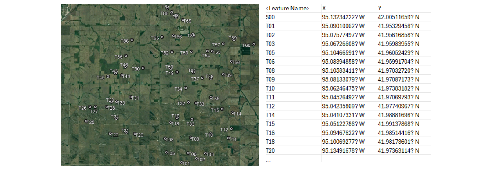
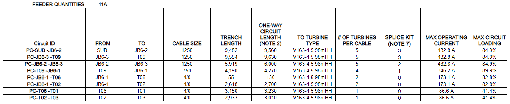

# MV Collection System Mapping

This tool supports the medium voltage collection system design process for terrestrial wind farms. 

### Input
Coordinates of a wind turbine generator (WTG) array and substation in CSV format.

### Output
KML map file with power load and turbine location data embedded.

### Outcomes
1. Initial KML file for MV Collection System design. Edit the cable routes further in any GIS tool to avoid obstacles, crossings, and restricted land parcels.
2. Automated cable sizing and cable schedule creation.

# Capacitated Minimum Spanning Tree Problem

### Problem Statement
An optimal WTG network should theoretically be designed as a capacitated minimum spanning tree (CMST). This is a minimum spanning tree with the following attributes:
- A root node, which is the central hub of the network
- The number of nodes on branches of the tree must not exceed a capacity value

An additional requirement for terrestrial wind farms is to avoid all crossing paths so that cable trenching is feasible.

The CMST is applied to networking problems in which a central hub is connected to sub-networks with balanced loads. Examples include computer networking and communications, transportation route planning, as well as cable routing. Finding the CMST is an NP-hard combinatorial optimization problem with no efficient solution algorithms. While heuristics exist to solve suboptimal CMST's, these do not satisfy the land-based constraints for designing practical medium voltage cable networks.

### Solution
Due to land control, roads, wetlands, buildings, and further geotechnical constraints, terrestrial MV collection system layouts require a thoughtful design process. This tool provides MST and suboptimal CMST visualizations to guide the layout. Then, user input of WTG groups allows flexibility for project-specific constraints. Finally, MST algorithms are used to connect each group of WTG's to the substation, and a KML output file is produced.

# Sample Workflow

### Turbine and Substation Coordinates (CSV)

 

### Output KML

### Adjust Cable Routes & Add Junction Boxes

### Automated Cable Schedule Creation

### MV Collection System Single Line Diagram

# Electrical Studies

To assess the viability of the planned collection system, the following studies should be completed.

### Ampacity Study

Evaluate cable thermal capacity under steady state loads within the worst-case geotechnical conditions of the project site. 

### Load Flow and Reactive Power Study

Evaluate the ability to meet reactive power and voltage requirements set by the utility operator at the point of interconnection. 

### Short Circuit Study

Evaluate the fault current contributions and verify that equipment is rated to withstand worst-case short circuit currents. 

### Energy Loss Estimate

Evaluate energy generation and value engineering opportunities.

