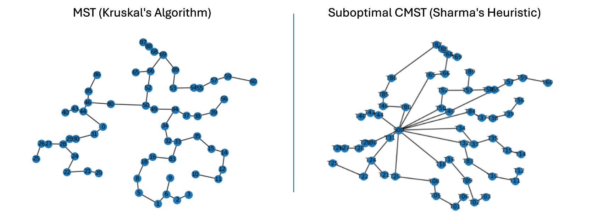

# MV Collection System Layout

This tool supports the medium voltage collection system design process for terrestrial wind farms. A capacitated minimum spanning tree problem is used to help optimize the design. 

Open an [example project](workbook_sq.ipynb) to view the design process. See [collection_mapper](collection_mapper.ipynb) for the blank Jupyter notebook. 

### Input
Latitude/longitude coordinates of a wind turbine array and substation in CSV format.

### Output
KML map file with circuit loading and turbine location data embedded.

### Outcomes
1. Initial layout for the medium voltage collection system created as a KML map file. Edit the cable routes further in any geographic visualization software.
2. Automated cable sizing and cable schedule creation.
3. Necessary inputs generated for drawing the single line diagram and completing electrical system studies.

# Capacitated Minimum Spanning Tree Problem

### Problem Statement
A medium voltage collection system connects all wind turbine generators (WTG's) to a central substation, and then interconnects to the power grid. An optimal collection system should theoretically be designed as a capacitated minimum spanning tree (CMST). This is a minimum spanning tree with the following attributes:
- A root node, which is the central hub of the network
- The number of nodes on branches of the tree must not exceed a capacity value

An additional requirement for terrestrial wind farms is to avoid all crossing paths so that cable trenching is feasible.

The CMST is applied to networking problems in which a central hub is connected to sub-networks with balanced loads. Examples include computer networking and communications, transportation route planning, as well as cable routing. Finding the CMST is an NP-hard combinatorial optimization problem with no efficient solution algorithms. While heuristics exist to solve suboptimal CMST's, these do not satisfy the land-based constraints for designing practical underground cable networks.

### Solution
Due to land control, roads, wetlands, buildings, and further geotechnical constraints, terrestrial MV collection system layouts require a thoughtful design process. This tool provides MST and suboptimal CMST visualizations to guide the layout. Then, user input of WTG groups allows flexibility for site-specific constraints. Finally, MST algorithms are used to connect each group of WTG's to the substation, and a KML output file is produced.

# Sample Workflow

### Turbine and Substation Coordinates
Given a turbine array, use spatial analysis software (Global Mapper or Google Earth Pro) to generate a CSV containing longitude/latitude coordinates for the project.

The program will generate a minimum spanning tree (left) and a suboptimal capacitated minimum spanning tree (right) to guide user input of WTG groupings. Due to site-specific variables, user input is desired for the final grouping rather than any theoretically optimal configuration. 

The MST is generated using Kruskal's algorithm from the NetworkX library. The suboptimal CMST with no crossings is programmed and generated according to Sharma's heuristic.1

1 Sharma RL, El-Bardai MT (1970) _Suboptimal communications network synthesis_. Proceedings 1970 International Conference on Communications.

### Output KML

After the user inputs desired WTG groupings, the following will be generated:

- MST's connecting each group to the substation
- Circuit loading calculations embedded in the KML data
- Output KML (visualized in Google Earth Pro)

### Adjust Cable Routes & Add Junction Boxes
The minimum spanning tree paths need to be adjusted to accomodate routing issues for terrestrial cable networks:
- Avoid residences, floodplains & water features, land parcels without lease agreements, slopes above 12%, and other obstacles
- Bore across roads and rivers perpendicularly to minimize distance
- Align paths in parallel where possible to minimize disturbance
- Route paths along the edges of parcels and near roads in cost-efficient cases

In addition, 3-way junction boxes are placed at diverging paths, and 2-way junction boxes are placed on cable segments longer than 10,000 ft. 

### Automated Cable Schedule Creation
The following cable schedule is generated to be included in construction plans. Only one circuit is shown.

### MV Collection System Single Line Diagram
A single line diagram is then drawn accordingly to be included in construction plans. This is also used to model the system in electrical studies outlined below.

# Electrical Studies

To assess the viability of the planned collection system, the following studies should be completed.

### Ampacity Study

Evaluate cable thermal capacity under steady state loads within the worst-case geotechnical conditions of the project site. 

### Load Flow and Reactive Power Study

Evaluate the ability to meet reactive power and voltage requirements set by the utility operator at the point of interconnection. 

### Short Circuit Study

Evaluate the fault current contributions and verify that equipment is rated to withstand worst-case short circuit currents. 

### Loss Study

Evaluate energy generation at the point of interconnection and value engineering opportunities.

